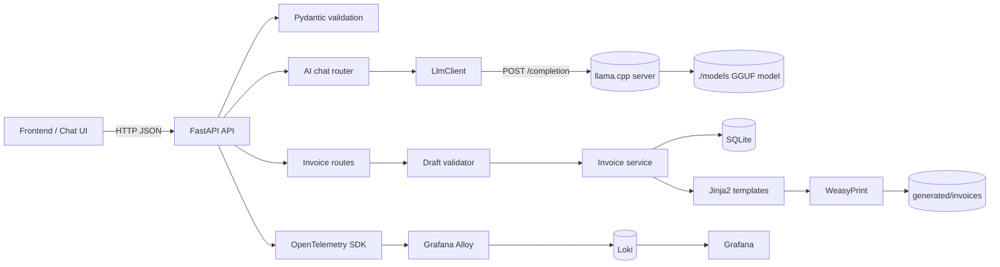
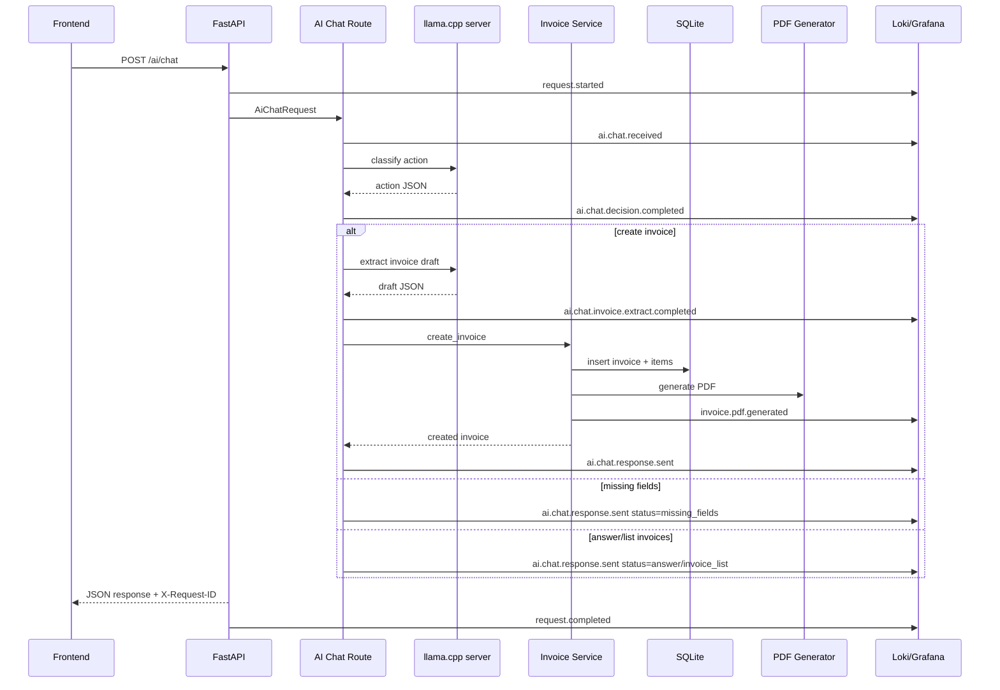
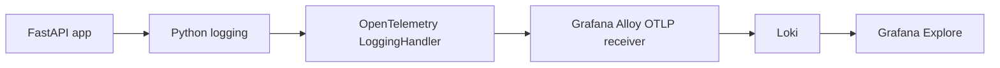

# Document Generation API

Lightweight FastAPI MVP for generating invoice PDFs and routing chat messages through a local dockerized `llama.cpp` server.

## Current Features

- Validate invoice requests with Pydantic.
- Calculate item amounts, subtotal, and total in the backend.
- Store invoices and items in SQLite.
- Render trusted Jinja2 invoice templates.
- Generate and store PDFs with WeasyPrint.
- List, reset, and download generated invoices.
- Route general chat messages to a direct answer, invoice listing, or invoice creation.
- Extract a structured invoice draft from a chat message.
- Report backend-calculated missing invoice fields.
- Complete a validated draft and generate its PDF.
- Limit LLM processing to one request at a time.
- Run the local LLM through a Docker Compose `llama-server` service.
- Download the default GGUF model from `./start.sh` when missing.
- Persist SQLite data, generated files, and model files through mounted directories.
- Export logs to Grafana through OpenTelemetry, Grafana Alloy, and Loki.
- Emit structured application event logs with request IDs.

Not implemented yet:

- AI-generated or user-editable templates.
- Authentication and rate limiting.
- Taxes, discounts, queues, and additional document types.

## Architecture



The LLM only generates text. Invoice validation, calculations, storage, and PDF generation remain controlled by the backend.

## Runtime Request Flow



## Project Structure

```text
app/
  main.py
  config.py
  database.py
  schemas.py
  observability.py
  observability_events.py
  middleware/
    request_logging.py
  routes/
    ai_chat.py
    ai_invoice.py
    invoices.py
  services/
    ai_invoice_extractor.py
    invoice_draft_validator.py
    invoice_service.py
    llm_client.py
    pdf_service.py
  tests/
templates/
  invoice_ru.html
  invoice_en.html
observability/
  alloy/config.alloy
  grafana/provisioning/datasources/datasources.yml
docker/
  llama.cpp/
    Dockerfile
    entrypoint.sh
docs/
  llama-cpp-docker.md
  llama-cpp-stack-plan.md
models/
  .gitkeep
scripts/
  smoke_llama.sh
data/
generated/invoices/
Dockerfile
docker-compose.yml
start.sh
```

## Environment

Create local settings from the example:

```bash
cp .env.example .env
```

Available variables:

| Variable | Default | Purpose |
| --- | --- | --- |
| `LLM_BASE_URL` | `http://127.0.0.1:8080` | Reachable llama.cpp server address from the API container. |
| `LLM_COMPLETION_ENDPOINT` | `/completion` | llama.cpp completion route. |
| `LLM_TIMEOUT_SECONDS` | `180` | LLM request timeout. CPU inference can be slow on 1 OCPU. |
| `LLM_MAX_TOKENS` | `256` | Maximum generated tokens requested by the API. |
| `LLM_TEMPERATURE` | `0.2` | Generation temperature. |
| `LLAMA_MODEL_FILE` | `Qwen2.5-3B-Instruct-Q4_K_M.gguf` | GGUF model file name inside `./models`. |
| `LLAMA_MODEL_URL` | default Qwen2.5 3B GGUF URL | Download URL used by `./start.sh` when the model file is missing. |
| `LLAMA_CPP_REF` | `master` | llama.cpp Git ref used during Docker image build. |
| `LLAMA_THREADS` | `1` | CPU threads for llama.cpp. Keep `1` on a 1 OCPU VPS. |
| `LLAMA_CONTEXT_SIZE` | `2048` | llama.cpp context size. Increase only after testing memory and latency. |
| `LLAMA_PARALLEL` | `1` | Parallel generations. Keep `1` on small CPU-only VPS. |
| `LLAMA_MAX_TOKENS` | `256` | llama.cpp server default max tokens. |
| `LLAMA_SERVER_PORT` | `8080` | Host port bound to `127.0.0.1` for llama.cpp. |
| `LLAMA_EXTRA_ARGS` | empty | Optional extra flags passed to llama.cpp. |
| `SERVICE_NAME` | `document-generation-api` | Service name used in logs and OpenTelemetry resource attributes. |
| `DEPLOYMENT_ENVIRONMENT` | `local` | Environment name used in logs. |
| `LOG_LEVEL` | `INFO` | Python logging level. |
| `OTEL_ENABLED` | `false` in app config, `true` in Compose | Enables OpenTelemetry log export. |
| `OTEL_TRACES_ENABLED` | `false` | Enables OpenTelemetry trace export. |
| `OTEL_EXPORTER_OTLP_ENDPOINT` | `http://127.0.0.1:4318` | OTLP HTTP endpoint for Grafana Alloy. |
| `APP_LOG_FRONTEND_MESSAGES` | `true` | Include frontend chat/invoice messages in application event logs. |
| `APP_LOG_RESPONSE_BODY` | `true` | Include summarized response bodies in application event logs. |
| `APP_LOG_LLM_RAW` | `false` | Include raw LLM prompts/responses in debug logs. |
| `APP_LOG_DEBUG_PAYLOADS` | `false` | Enables all debug payload logging flags. |
| `APP_LOG_MAX_FIELD_LENGTH` | `2000` | Truncates long logged string fields. |
| `GRAFANA_ADMIN_USER` | `admin` | Grafana admin username. |
| `GRAFANA_ADMIN_PASSWORD` | `admin` | Grafana admin password. |

`.env` is ignored by Git.

For production, consider disabling full message and response body logging:

```env
APP_LOG_FRONTEND_MESSAGES=false
APP_LOG_RESPONSE_BODY=false
APP_LOG_LLM_RAW=false
APP_LOG_DEBUG_PAYLOADS=false
```

## Start the API, llama.cpp, and Observability Stack

Docker must be installed and running.

```bash
./start.sh
```

On first run, the script will:

1. Create `./models` if missing.
2. Download the default GGUF model if it is not already present.
3. Build the API image.
4. Build the CPU-only llama.cpp image.
5. Start API, llama.cpp, Grafana, Loki, and Alloy.

Force a build without Docker cache:

```bash
./start.sh --no-cache
```

Equivalent manual command after the model exists:

```bash
docker compose up --build -d
```

Local addresses:

| Service | URL |
| --- | --- |
| API | `http://localhost:8000` |
| API docs | `http://localhost:8000/docs` |
| llama.cpp | `http://127.0.0.1:8080` |
| Grafana | `http://localhost:3000` |
| Loki | `http://localhost:3100` |
| Alloy UI | `http://localhost:12345` |
| OTLP HTTP | `http://localhost:4318` |

Grafana defaults:

```text
admin / admin
```

Useful commands:

```bash
docker compose logs -f api
docker compose logs -f llama-server
docker compose logs -f alloy
docker compose logs -f loki
docker compose ps
docker compose down
```

Smoke test llama.cpp:

```bash
./scripts/smoke_llama.sh
```

## Dockerized llama.cpp

The default model is:

```text
Qwen2.5-3B-Instruct-Q4_K_M.gguf
```

The model is stored locally at:

```text
./models/Qwen2.5-3B-Instruct-Q4_K_M.gguf
```

GGUF files are ignored by Git. The `models/.gitkeep` file exists only to keep the directory in the repository.

The llama.cpp service uses conservative defaults for a 1 OCPU / 9 GB RAM VPS:

```env
LLAMA_THREADS=1
LLAMA_CONTEXT_SIZE=2048
LLAMA_PARALLEL=1
LLAMA_MAX_TOKENS=256
LLM_TIMEOUT_SECONDS=180
```

The service is bound to host localhost only:

```text
127.0.0.1:8080
```

Do not expose this port publicly. Public clients should call only the FastAPI backend.

More details:

```text
docs/llama-cpp-docker.md
docs/llama-cpp-stack-plan.md
```

## macOS Development With VPS LLM

Because the VPS llama.cpp server listens only on localhost, use an SSH tunnel when developing from macOS:

```bash
ssh -N -L 8080:127.0.0.1:8080 ubuntu@161.153.29.155
```

For an API running inside Docker Desktop, set:

```env
LLM_BASE_URL=http://host.docker.internal:8080
```

Then restart:

```bash
./start.sh
```

The repository Compose file uses Linux host networking for VPS deployment. To run the API container through Docker Desktop, use a local Compose override with `ports: ["8000:8000"]` and remove host networking.

## Linux VPS Deployment

The repository is configured for the API container and dockerized llama.cpp to run on the same Linux VPS. The API container uses:

```yaml
network_mode: "host"
```

The llama.cpp service publishes only to host localhost:

```yaml
ports:
  - "127.0.0.1:8080:8080"
```

Recommended VPS `.env`:

```env
LLM_BASE_URL=http://127.0.0.1:8080
LLM_COMPLETION_ENDPOINT=/completion
LLM_TIMEOUT_SECONDS=180
LLM_MAX_TOKENS=256
LLM_TEMPERATURE=0.2

LLAMA_MODEL_FILE=Qwen2.5-3B-Instruct-Q4_K_M.gguf
LLAMA_THREADS=1
LLAMA_CONTEXT_SIZE=2048
LLAMA_PARALLEL=1
LLAMA_MAX_TOKENS=256
LLAMA_SERVER_PORT=8080

OTEL_ENABLED=true
OTEL_EXPORTER_OTLP_ENDPOINT=http://127.0.0.1:4318
APP_LOG_FRONTEND_MESSAGES=true
APP_LOG_RESPONSE_BODY=true
APP_LOG_LLM_RAW=false
APP_LOG_DEBUG_PAYLOADS=false
```

Then run:

```bash
./start.sh
```

Keep Oracle Cloud and OS firewall rules for port `8080` closed. If Grafana, Loki, or Alloy are not protected by firewall or reverse proxy authentication, avoid exposing their ports publicly too.

## Logging and Observability

The app uses two logging layers:

- OpenTelemetry/FastAPI/HTTPX instrumentation for infrastructure-level request and dependency telemetry.
- Explicit application event logs for business flow visibility.

Application event logs are JSON objects emitted to Python logging and exported to Loki through OpenTelemetry and Grafana Alloy.



Each request gets an `X-Request-ID` response header. The same request ID is included in all structured event logs for that request.

Key events:

| Event | Purpose |
| --- | --- |
| `request.started` | Request entered the backend. |
| `request.completed` | Request completed with status and duration. |
| `ai.chat.received` | Frontend chat message reached backend. |
| `ai.chat.decision.completed` | LLM selected `answer`, `list_invoices`, or `create_invoice`. |
| `ai.chat.invoice.extract.completed` | Invoice draft was extracted/merged for chat flow. |
| `ai.chat.invoice.validation.completed` | Backend calculated missing fields. |
| `ai.chat.response.sent` | Chat route response sent to frontend. |
| `invoice.extract.received` | Direct invoice extraction request received. |
| `invoice.extract.response.sent` | Extraction response sent to frontend. |
| `invoice.draft.complete.received` | Draft completion request received. |
| `invoice.draft.complete.response.sent` | Draft completion response sent to frontend. |
| `invoice.service.create.started` | Invoice persistence started. |
| `invoice.database.saved` | Invoice database row inserted. |
| `invoice.database.items_saved` | Invoice items inserted. |
| `invoice.pdf.generated` | PDF file generated. |
| `invoice.service.create.completed` | Invoice fully created. |
| `llm.request.started` | LLM HTTP request started. |
| `llm.request.completed` | LLM HTTP request completed. |
| `llm.request.failed` | LLM HTTP request failed. |
| `llm.response.parsed` | LLM response parsed successfully. |

Open Grafana, go to Explore, select the Loki datasource, and query all app logs:

```logql
{service_name="document-generation-api"} | json
```

Single request by request ID:

```logql
{service_name="document-generation-api"} | json | request_id="<X-Request-ID>"
```

Frontend messages:

```logql
{service_name="document-generation-api"} | json | event="ai.chat.received"
```

Responses sent to frontend:

```logql
{service_name="document-generation-api"} | json | event="ai.chat.response.sent"
```

Extracted invoice fields:

```logql
{service_name="document-generation-api"} | json | event="ai.chat.invoice.extract.completed"
```

Missing fields:

```logql
{service_name="document-generation-api"} | json | status="missing_fields"
```

LLM failures:

```logql
{service_name="document-generation-api"} | json | event="llm.request.failed"
```

Created invoice count over time:

```logql
count_over_time({service_name="document-generation-api"} | json | event="invoice.service.create.completed" [5m])
```

Enable raw LLM prompt/response logs only when needed:

```bash
APP_LOG_LLM_RAW=true ./start.sh
```

Enable every debug payload flag:

```bash
APP_LOG_DEBUG_PAYLOADS=true ./start.sh
```

Raw LLM logs can contain business/client text. Do not keep them enabled in production.

## API Endpoints

### Health

```http
GET /health
```

```bash
curl http://localhost:8000/health
```

Response:

```json
{"status":"ok"}
```

### General Chat

General chat should use:

```http
POST /ai/chat
```

The backend asks the LLM to choose between a direct answer, invoice listing, or invoice creation. Responses include `status: "answer"`, `"invoice_list"`, `"missing_fields"`, or `"created"`.

```bash
curl -X POST http://localhost:8000/ai/chat \
  -H "Content-Type: application/json" \
  -d '{
    "message": "Create an invoice for Alex for website design, 300 dollars."
  }'
```

### Extract Invoice Draft From Chat

```http
POST /ai/invoice/extract
```

```bash
curl -X POST http://localhost:8000/ai/invoice/extract \
  -H "Content-Type: application/json" \
  -d '{
    "message": "Create an invoice for Alex for website design, 300 dollars."
  }'
```

The response contains:

- `status: "missing_fields"` when required information is absent.
- `status: "ready"` when the draft is complete.
- The validated `draft`.
- A backend-calculated `missing_fields` list.

The backend ignores any missing-field list suggested by the model. An offline LLM returns HTTP `503` with `status: "llm_unavailable"`. Invalid model JSON returns HTTP `422` with `status: "ai_parse_error"`.

### Generate Invoice Directly From Message

```http
POST /ai/invoice/generate
```

```bash
curl -X POST http://localhost:8000/ai/invoice/generate \
  -H "Content-Type: application/json" \
  -d '{
    "message": "Create an invoice for Alex for website design, 300 dollars. Invoice number INV-001. My business is Sargis Studio."
  }'
```

### Complete Draft And Generate PDF

```http
POST /invoices/draft/complete
```

```bash
curl -X POST http://localhost:8000/invoices/draft/complete \
  -H "Content-Type: application/json" \
  -d '{
    "draft": {
      "document_type": "invoice",
      "invoice_number": "INV-001",
      "issue_date": "2026-06-15",
      "due_date": "2026-06-22",
      "currency": "USD",
      "business": {
        "name": "Sargis Studio",
        "email": "hello@example.com",
        "address": "Yerevan, Armenia"
      },
      "client": {
        "name": "Alex",
        "email": "alex@example.com",
        "address": null
      },
      "items": [
        {
          "description": "Website design",
          "quantity": 1,
          "unit_price": 300
        }
      ],
      "notes": "Thank you for your business.",
      "payment_terms": "Payment due within 7 days."
    }
  }'
```

Successful response:

```json
{
  "status": "created",
  "invoice_id": 1,
  "invoice_number": "INV-001",
  "subtotal": 300.0,
  "total": 300.0,
  "currency": "USD",
  "pdf_url": "/invoices/1/download"
}
```

Incomplete drafts return `status: "missing_fields"` and do not create database records or PDF files.

### Create Invoice

```http
POST /invoices
```

```bash
curl -X POST http://localhost:8000/invoices \
  -H "Content-Type: application/json" \
  -d '{
    "invoice_number": "INV-001",
    "issue_date": "2026-06-15",
    "due_date": "2026-06-22",
    "currency": "USD",
    "business": {
      "name": "Sargis Studio",
      "email": "hello@example.com",
      "address": "Yerevan, Armenia"
    },
    "client": {
      "name": "Alex Johnson",
      "email": "alex@example.com",
      "address": "New York, USA"
    },
    "items": [
      {
        "description": "Website design",
        "quantity": 1,
        "unit_price": 300
      },
      {
        "description": "Hosting setup",
        "quantity": 1,
        "unit_price": 50
      }
    ],
    "notes": "Thank you for your business.",
    "payment_terms": "Payment due within 7 days."
  }'
```

The client does not provide totals or file paths.

### List Invoices

```bash
curl http://localhost:8000/invoices
```

### Reset Invoices

```bash
curl -X DELETE http://localhost:8000/invoices
```

### Download Invoice

```bash
curl -o invoice.pdf http://localhost:8000/invoices/1/download
```

The `pdf_url` returned during creation can also be opened directly.

## Storage

- SQLite database: `data/app.db`
- Generated PDFs: `generated/invoices/`
- Trusted templates: `templates/invoice_ru.html`, `templates/invoice_en.html`
- Local GGUF models: `models/`

The `data/`, `generated/`, and `models/` directories are mounted into containers, so their contents survive image rebuilds.

Invoice numbers are unique. Generated filenames are sanitized and include a random suffix. User input is autoescaped by Jinja2.

## Tests

To run tests directly on the host, first install project dependencies in a virtual environment:

```bash
python3 -m venv .venv
source .venv/bin/activate
pip install -r requirements.txt
pytest app/tests
```

Run them inside the built API container:

```bash
docker compose run --rm api pytest app/tests
```

Tests cover:

- Invoice and AI request validation.
- Currency and text normalization.
- Due-date validation.
- Monetary calculation and rounding.
- Safe PDF filename generation.
- LLM request payload and answer parsing.
- LLM HTTP, invalid JSON, and empty-answer failures.
- Strict invoice JSON extraction and validation.
- Backend missing-field detection.
- AI extraction error responses.
- Completed-draft invoice creation response.

The unit tests mock external LLM calls and do not contact the VPS.

## Security Notes

- Do not publicly expose llama.cpp port `8080`.
- Do not publicly expose Grafana/Loki/Alloy without firewall, authentication, or reverse proxy protection.
- Do not allow the LLM to generate executable code or production templates.
- Do not pass secrets in prompts.
- Raw LLM logging can contain business/client data; keep `APP_LOG_LLM_RAW=false` unless debugging.
- Full frontend message and response body logging should be disabled before real-user deployment if those messages contain sensitive data.
- Add authentication and rate limiting before real-user deployment.

## Current LLM Limitation

The default `Qwen2.5-3B-Instruct-Q4_K_M.gguf` model is stronger than the previous SmolLM2 360M test model, but this is still a small CPU-only deployment. Keep prompts short and structured. Do not trust the LLM for calculations or business decisions. All extracted data is validated by Pydantic, and the backend calculates trusted totals before invoice creation.
