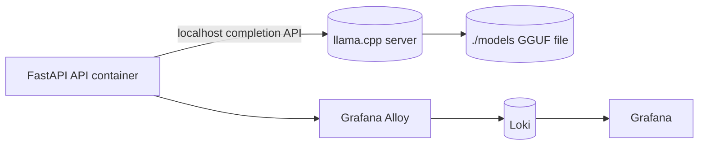

# Dockerized llama.cpp runtime

This project runs the local LLM through a `llama-server` Docker Compose service.

## Default model

Default model file:

```text
Qwen2.5-3B-Instruct-Q4_K_M.gguf
```

The file is stored locally under:

```text
./models/Qwen2.5-3B-Instruct-Q4_K_M.gguf
```

`./start.sh` downloads the default model when the file is missing. GGUF files are ignored by Git.

## Runtime layout



The API container uses Linux host networking for VPS deployment. The `llama-server` container publishes port `8080` only on `127.0.0.1`, so it is reachable by the API but not publicly exposed.

## Conservative VPS defaults

These defaults target a small VPS with 1 OCPU, 9 GB RAM, and no GPU:

```env
LLAMA_THREADS=1
LLAMA_CONTEXT_SIZE=2048
LLAMA_PARALLEL=1
LLAMA_MAX_TOKENS=256
LLM_TIMEOUT_SECONDS=180
```

The model should fit in 9 GB RAM together with the API and observability stack, but generation speed is limited by 1 OCPU.

## Start everything

```bash
./start.sh
```

Force a clean rebuild:

```bash
./start.sh --no-cache
```

## Useful commands

```bash
docker compose logs -f llama-server
docker compose logs -f api
docker compose ps
docker compose down
```

## Custom model

Use another GGUF model by setting these variables before running `start.sh`:

```bash
LLAMA_MODEL_FILE=your-model.gguf \
LLAMA_MODEL_URL=https://example.com/your-model.gguf \
./start.sh
```

The file will be placed under `./models` if missing.
