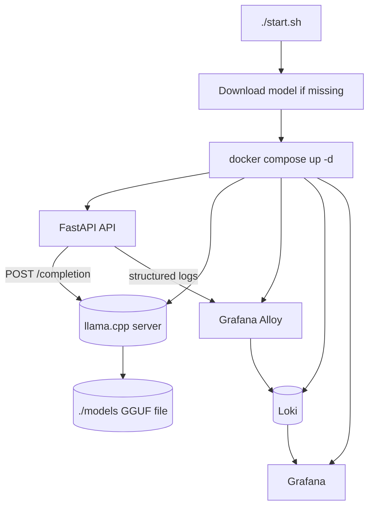

# llama.cpp Docker Stack Plan

## Goal

Run FastAPI, llama.cpp, and the observability stack together from one command:

```bash
./start.sh
```

The target VPS is small:

```text
1 OCPU
9 GB RAM
No GPU
```

The stack uses llama.cpp instead of Ollama because llama.cpp gives direct control over model file, CPU threads, context size, parallelism, and the HTTP completion API.

## Selected model

Default model:

```text
Qwen2.5-3B-Instruct-Q4_K_M.gguf
```

Reason:

- Stronger than the current SmolLM2 360M test model.
- Still realistic for a 9 GB RAM CPU-only VPS.
- Good fit for short structured document tasks: intent detection, invoice extraction, missing-field detection, and memory candidate extraction.

## Conservative runtime settings

```env
LLAMA_THREADS=1
LLAMA_CONTEXT_SIZE=2048
LLAMA_PARALLEL=1
LLAMA_MAX_TOKENS=256
LLM_TIMEOUT_SECONDS=180
```

These settings protect the VPS from CPU/RAM overload. Later testing can raise `LLAMA_CONTEXT_SIZE` to `4096` if memory and latency are acceptable.

## Architecture



## Security

- llama.cpp is bound to `127.0.0.1:8080` on the host.
- The public client should call only FastAPI.
- Do not expose port `8080` publicly in Oracle Cloud or OS firewall rules.

## Acceptance criteria

- `./start.sh` downloads the model if missing.
- `./start.sh` builds and starts the API, llama.cpp, Grafana, Loki, and Alloy.
- API calls llama.cpp through `http://127.0.0.1:8080/completion`.
- llama.cpp logs are available with `docker compose logs -f llama-server`.
- API logs still go to Grafana/Loki.
- GGUF files are ignored by Git.
