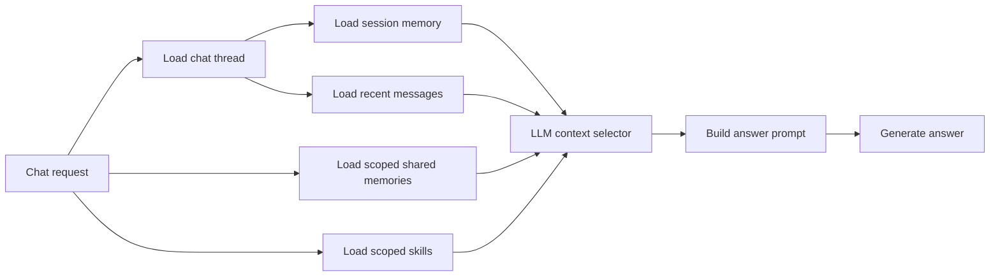

# Memory system

The document-generation assistant uses three kinds of memory. Each kind solves a different problem and has a different lifetime.

This documentation describes the current implementation. It does not describe the full target architecture from [GitHub issue #7](https://github.com/sargis-tovmasyan/document-generation-api-ai/issues/7).

## Memory types

| Memory type | Purpose | Lifetime | Typical example |
| --- | --- | --- | --- |
| [Session memory](session-memory.md) | Keeps temporary state for one chat | One chat thread | An unfinished invoice draft or a number the user asked the assistant to remember in this chat |
| [Shared memory](shared-memory.md) | Reuses durable facts and preferences across chats | Until disabled, rejected, or expired | A preferred invoice currency or normal payment terms |
| [Skill memory](skill-memory.md) | Reuses structured document workflows | Until disabled or rejected | Steps for preparing a recurring monthly support invoice |

## How memory enters an answer

The context selector decides whether an answer needs no context, recent chat messages, saved memories, or both. This prevents unrelated memory from being added to every prompt.

## Important boundaries

- Invoices and invoice items remain structured database records. Memory is supporting context, not the source of truth for business or legal data.
- Explicit temporary requests such as "remember number 42" stay in session memory. They do not become shared memory.
- Shared and skill memories include a source chat, confidence score, and status.
- Low-confidence shared and skill candidates use the `needs_review` status.
- The application currently has no authentication or user profiles. Requests use `default_user` unless the caller provides another `user_id`.
- Because identity is supplied by the caller, the current implementation must be treated as single-user. It does not provide secure tenant isolation.

## Main API endpoints

| Endpoint | Purpose |
| --- | --- |
| `POST /ai/chat` | Send a non-streaming chat message |
| `POST /ai/chat/stream` | Send a streaming chat message |
| `POST /chat-threads` | Create a chat thread |
| `GET /chat-threads` | List chat threads |
| `GET /chat-threads/{chat_id}` | Load a thread, messages, and session state |
| `GET /chat-threads/{chat_id}/session-memory` | Read session memory |
| `DELETE /chat-threads/{chat_id}/session-memory/document-scope` | Clear the active document state |
| `GET /shared-memories` | List active shared memories |
| `PATCH /shared-memories/{memory_id}` | Change shared-memory status |
| `GET /skill-memories` | List active skills |
| `PATCH /skill-memories/{skill_id}` | Change skill status |

## Implementation map

- `app/services/chat_schema.py`: chat thread, message, and session-memory tables.
- `app/services/chat_store.py`: chat and session-memory persistence.
- `app/services/knowledge_store.py`: shared memory, skill memory, and audit-event persistence.
- `app/services/learning_extractor.py`: LLM-based fact and skill candidate extraction.
- `app/routes/ai_chat_memory.py`: chat routing, context selection, memory use, and learning calls.
- `app/routes/chat_threads.py`: chat-thread and session-memory endpoints.
- `app/routes/memories.py`: shared-memory and skill-memory endpoints.

## Current limitations

The following parts of issue #7 are not implemented yet:

- Authenticated user and tenant context.
- Business and client profile tables that override conflicting memories.
- Backend secret and sensitive-data validation for memory candidates.
- Shared-memory deduplication and merging.
- Query-based shared-memory retrieval.
- Skill selection based directly on `trigger_text`.
- Complete audit events and structured logs for retrieval, rejection, and usage.
- PostgreSQL and vector retrieval. SQLite remains the current database.

