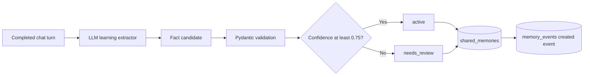

# Shared memory

Shared memory stores durable facts, preferences, and defaults that may help in later chats. "Shared" means shared across allowed chats in the same scope. It must not mean shared between unrelated users or tenants.

## Good candidates

Examples of useful shared memory:

- The user prefers English invoice templates.
- A business normally uses seven-day payment terms.
- A client normally receives invoices in USD.
- A business usually appears as the service provider.

The extractor should not save greetings, general questions, passwords, one-time invoice values, or temporary "remember this number" requests.

## Learning flow



The learning extractor reviews recent messages and session state after meaningful chat turns. It returns structured JSON candidates. The backend validates their shape before storing them.

Each stored fact includes:

- `user_id`
- Optional `business_profile_id`
- Optional `client_id`
- `source_chat_id`
- Memory type and content
- Optional structured JSON
- Confidence and status
- Creation, update, expiration, and last-used timestamps

## Retrieval

The current store retrieves active memories that match the supplied user, business, and client scope. It orders exact client matches first, then business matches, confidence, and update time. The chat route limits how many records enter context.

An LLM context selector then decides whether the current answer needs saved memory. Normal greetings and standalone questions should not receive saved-memory context.

## Status management

Supported statuses are:

| Status | Meaning |
| --- | --- |
| `active` | Available for retrieval |
| `needs_review` | Stored but excluded from normal retrieval |
| `disabled` | Manually disabled |
| `rejected` | Reviewed and rejected |

Use these endpoints:

- `GET /shared-memories`
- `PATCH /shared-memories/{memory_id}`

Example status update:

```json
{
  "status": "disabled"
}
```

## Implementation details

- Candidate extraction: `app/services/learning_extractor.py`
- Storage and retrieval: `app/services/knowledge_store.py`
- Management API: `app/routes/memories.py`
- Context selection and prompting: `app/routes/ai_chat_memory.py`

## Current limitations

- The application uses `default_user` and does not authenticate the supplied `user_id`.
- The backend does not yet reject secrets or sensitive information through a deterministic policy.
- Repeated or overlapping facts are not deduplicated or merged.
- Retrieval applies scope and ordering, but it does not match memory content against the current question.
- Business and client profile records do not exist yet, so deterministic profile data cannot override conflicting memory.
- Audit events are written when a fact is created, but not for every review, retrieval, usage, or status change.

